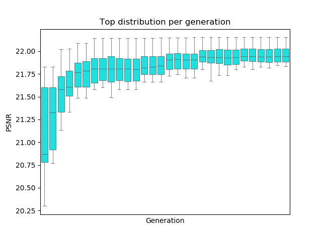
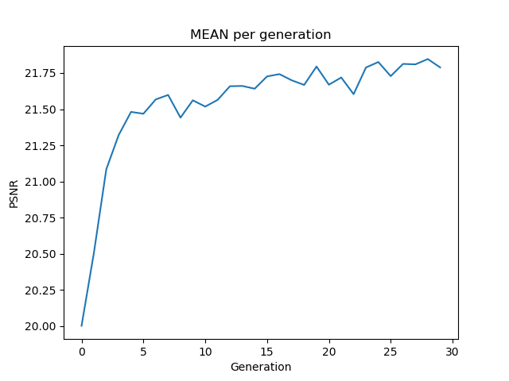
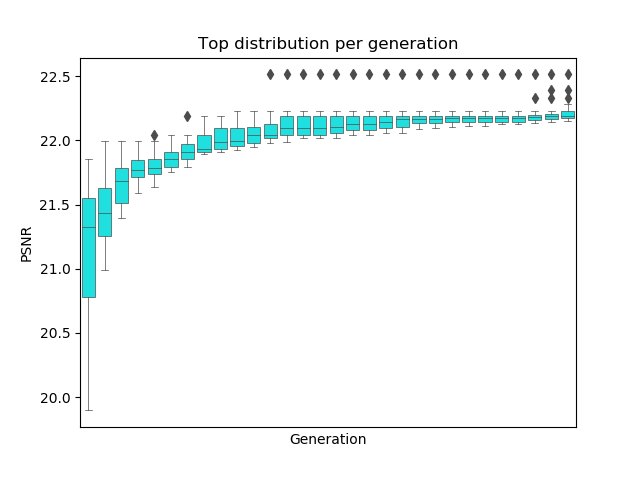
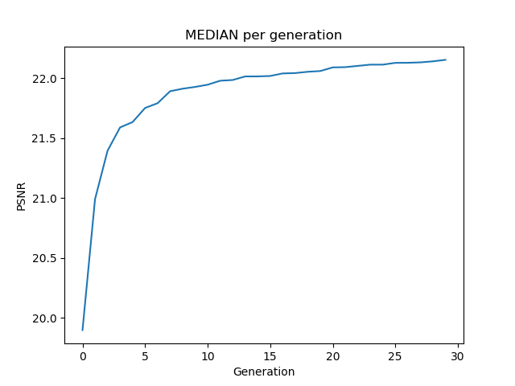

# Neural Architecture Search for Deep Image Prior

### Based on article https://arxiv.org/pdf/2001.04776.pdf

### Scripts description
- `analysis.py` - script used to create plots _(distribution per generation)_ from log file
- `evolution.py` - main script runs the evolutionary training algorithm distributed between several GPUs
- `model_generation.py` - module which generate model from list of units described on `unit` module 
- `train.py` - training script which forming learning per each GPU, runs by `subprocess` module from `evolution` script
- `unit.py` - module which working with binary structure of model (generation, transforming to units, transforming to hex/string)


### Example of usage
```console
foo@bar:~/DIP_NAS$ python evolution.py --img ./img/hr.png --gpus 4
```

### Distribution of fitness per generation

#### PSNR distribution _(average clipping selection of models)_
| |  |
| - | - |
#### PSNR distribution _(median clipping selection of models)_
| |  |
| - | - |

### TODO
- PSNR distribution _(mixin with random models)_
- Implement losses for other task (in-paint, de-noise)
